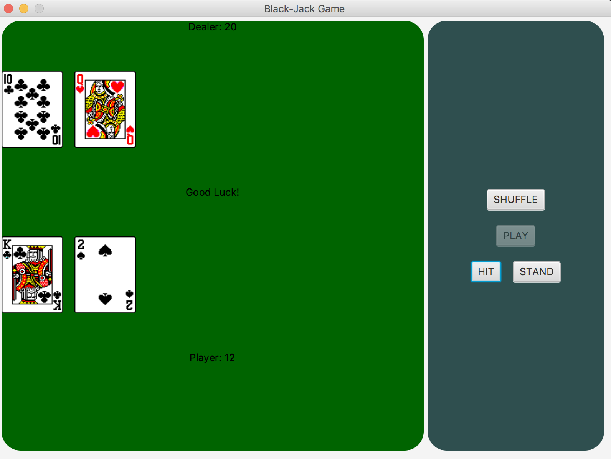

# Black Jack

This is a Black Jack game for my final project in CIS 171.

## Example Output

## Analysis Steps
I first asked myself how blackjack works. I had to make a card class that had a suit, value, and rank. 
I also had to think about the game and the dealer and the deck. I thought about how I wanted my program 
to look and how I wanted the user to interact with it. I drew diagrams on my whiteboard at home to get a 
better view of the overall project.

### Design
My design is simple. I wanted a simple user interface that was easy to use and understand. Two cards are displayed for the dealer
and for the player at the beginning of each game. When you click "Hit", a card draws and the program checks to see if you are below 
or above 21 and you can decide if you want to "Hit" again after you see what your number is at. You can "Stand" if you think you are 
as close to 21 as possible and don't want to risk busting.

### Testing
I tested this project pretty much every time I added something new to see if it was working. If something wasn’t working I would research and figure out why x,y,z wasn’t working. 
One of the challenges I encountered was the images. I tried using a switch, an array, for loops, but the only thing that I could get to work that was consistent is a TON of if 
statements that assign card pictrues to cards with the correct rank/ suit. Another issue I encountered was the shuffling. Since the cards were stored in a Card object, and not an 
array list, I couldn’t use the collections.shuffle() method. I fixed that by loading the objects into an array list. There were many other roadblocks that I had, those are just a few. 
## Adapted from a README Built With

* [Dropwizard](http://www.dropwizard.io/1.0.2/docs/) - The web framework used
* [Maven](https://maven.apache.org/) - Dependency Management
* [ROME](https://rometools.github.io/rome/) - Used to generate RSS Feeds
us.

## Acknowledgments And Developers

* Renee Riley CIS 171 Instructor

