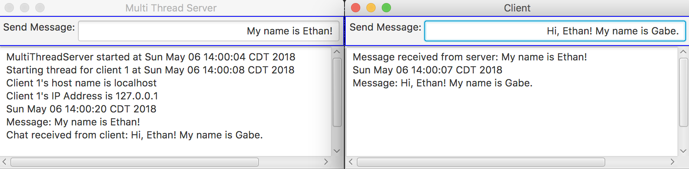

# Multi-Server Chat

This project simulates chat between a client and a server.

## Example Output




## Analysis Steps

This project simulates chat between a client and a server. To create this project, I used 
ArrayLists to store the sockets and threads to let the server and client communicate with one another.

### Design

I had a client class and a server class. The client class had an event handler that got the 
text from the Text Field, and sent the string through a DataInputStream. 
```
tf.setOnAction(e -> {
            try
            {
                //get the text from the text field
                String chat = tf.getText();
                // send the text to the server
                toServer.writeUTF(chat);
                toServer.flush();

                //display to text
                ta.appendText(date + "\nMessage: " + chat + '\n');
            }
            catch(IOException ex)
            {
                System.err.println(ex);
            }
        });
```

The server class had something similar as well: 
```
tf.setOnAction(e -> {

            try
            {
                for(Socket socket : sockets)
                {
                    // Data output stream that gets the output stream from socket
                    DataOutputStream toClient = new DataOutputStream(socket.getOutputStream());
                    System.out.println("Send message to client");

                    toClient.writeUTF(tf.getText() + '\n');
                    toClient.flush();


                }
                //get the text from the text field
                String chat = tf.getText();

                //display text
                ta.appendText(new Date() + "\nMessage: " + chat + '\n');

            }
            catch(IOException ex)
            {
                System.err.println(ex);
            }
        });
```

### Testing

Testing was mostly trying to see if the client/server was getting the strings. I changed some stuff around from
the listing to send Strings over a thread and from there it was just adding a text field to the server and getting 
the text from that and sending it back to the client.

## Notes

For a very long time I had a bug where the thread would be "jammed" and it would only send messages if you spammed 
chat, then the whole program would melt down. The issue was that I had a "toClient.writeChars(tf.getText());" that was 
completely hogging the thread, but when I switched to "toClient.writeUTF(tf.getText());" it fixed
my bug. 

## Adapted from a README Built With

* [Dropwizard](http://www.dropwizard.io/1.0.2/docs/) - The web framework used
* [Maven](https://maven.apache.org/) - Dependency Management
* [ROME](https://rometools.github.io/rome/) - Used to generate RSS Feeds

## Versioning

We use [SemVer](http://semver.org/) for versioning. For the versions available, see the [tags on this repository](https://github.com/your/project/tags). 

## Authors

* **Billie Thompson** - *Initial work* - [PurpleBooth](https://github.com/PurpleBooth)

See also the list of [contributors](https://github.com/your/project/contributors) who participated in this project.

## License

This project is licensed under the MIT License - see the [LICENSE.md](LICENSE.md) file for details

## Acknowledgments

* Listings in Chapter 32 that we did in class.
* Nick helped me a lot too!
